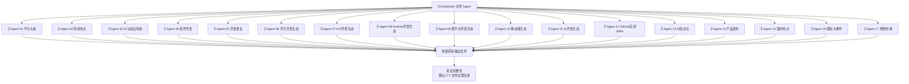

# 17 子 Agent 并行新闻生成配置

> **说明**：本配置文件定义如何通过 17 个子 Agent，并行执行 `task/morning_news/` 目录下的 17 个新闻板块任务，一次性生成完整早间新闻。

---

## 🎯 整体设计

### 执行日期
| 参数 | 值 |
|------|------|
| `{DATE}` | 2026-05-14（周四） |
| `{DATE-1}` | 2026-05-13（周三） |
| `{DATE-2}` | 2026-05-12（周二） |
| `{YYYYMM}` | 202605 |
| `{YYYYMMDD}` | 20260514 |
| **搜索时段** | 2026-05-13 07:00 ~ 2026-05-14 07:00（24小时） |
| **输出根目录** | `news/202605/20260514/` |

### 前置步骤
```bash
# 创建输出目录（统一执行一次）
mkdir -p /Users/ysrtc/Desktop/myNews/news/202605/20260514
```

### 执行流程图


---

## 🧩 子 Agent 定义（共 17 个）

### 通用执行规则（所有 Agent 共享）

1. **先搜索，再写作**：每个 Agent 必须先执行联网搜索，严禁凭记忆生成内容
2. **全量搜索原则**：各任务文件中的每个子领域关键词必须逐一执行，不得跳跃
3. **核实关键数据**：所有数字类信息必须通过第二次搜索确认
4. **严格基于搜索结果**：不得在搜索结果之外自行添加细节
5. **信息来源必填**：每条新闻末尾标注真实来源（媒体名称 + 报道日期）
6. **自动填充日期**：将任务文件中的 `{DATE}`、`{DATE-1}`、`{DATE-2}`、`{YYYYMM}`、`{YYYYMMDD}` 替换为实际日期值
7. **并发执行**：17 个子 Agent 同时启动，互不依赖
8. **跨模块去重**：02/03/04 模块之间需注意去重（同一事件从不同角度报道），15/16 模块与 01 模块之间需注意去重

---

### Agent 01 — 今日头条

| 项目 | 内容 |
|------|------|
| **任务文件** | `task/morning_news/01_今日头条.md` |
| **输出文件** | `news/202605/20260514/01_今日头条.md` |
| **新闻条数** | 3-5 条（优先生成 5 条） |
| **搜索优先级** | P0: 政治类、经济类、国际类 → P1: 科技类、社会类、金融安全类 → P2: 其余子领域 |
| **输出格式** | 每条包含：标题、导语、深度报道（事件经过/背景溯源/各界反应/深度影响）、AI深度研判（短期趋势/行业传导链/风险预警/机会捕捉/行动建议）、信息来源 |

---

### Agent 02 — 科技热点

| 项目 | 内容 |
|------|------|
| **任务文件** | `task/morning_news/02_科技热点.md` |
| **输出文件** | `news/202605/20260514/02_科技热点.md` |
| **新闻条数** | 7-15 条（优先生成 15 条） |
| **搜索优先级** | P0: AI/大模型、科技公司动态 → P1: 芯片半导体、互联网/APP → P2: 前沿科研、企业服务/SaaS、科技赋能传统行业、智能汽车 |
| **去重要求** | 与 03 模块严格区分（02 报道商业动态，03 报道技术突破） |

---

### Agent 03 — AI 与前沿科技

| 项目 | 内容 |
|------|------|
| **任务文件** | `task/morning_news/03_AI与前沿科技.md` |
| **输出文件** | `news/202605/20260514/03_AI与前沿科技.md` |
| **新闻条数** | 7-15 条（优先生成 12-15 条） |
| **搜索优先级** | P0: 大模型进展、AI技术前沿 → P1: AI产业化、AI政策与伦理 → P2: 前沿科技、推理优化、AI安全与对齐 |
| **去重要求** | 与 02 模块严格区分（本模块专注技术突破本身，不报道商业动态） |

---

### Agent 04 — 软件开发

| 项目 | 内容 |
|------|------|
| **任务文件** | `task/morning_news/04_软件开发.md` |
| **输出文件** | `news/202605/20260514/04_软件开发.md` |
| **新闻条数** | 5-10 条（优先生成 7-10 条） |
| **搜索优先级** | P0: AI开发框架与工具、移动端AI与开发 → P1: AI工程化与DevOps、开发者生态与社区 → P2: 新兴开发技术、系统架构、数据工程 |
| **去重要求** | 与 02/03 模块严格区分（本模块侧重开发者实践和工具选型） |

---

### Agent 05 — 开发语言

| 项目 | 内容 |
|------|------|
| **任务文件** | `task/morning_news/05_开发语言.md` |
| **输出文件** | `news/202605/20260514/05_开发语言.md` |
| **新闻条数** | 3-5 条（优先生成 5 条） |
| **搜索优先级** | P0: Python生态、Java/JVM → P1: Web前端语言、Go/Rust/系统语言 → P2: Apple平台语言、多范式语言、新兴语言、语言趋势 |
| **去重要求** | 与 07/08/11 模块严格区分（语言版本发布归本模块，框架生态归对应模块） |

---

### Agent 06 — 华为开发生态

| 项目 | 内容 |
|------|------|
| **任务文件** | `task/morning_news/06_华为开发生态.md` |
| **输出文件** | `news/202605/20260514/06_华为开发生态.md` |
| **新闻条数** | 7-10 条（优先生成 10 条） |
| **搜索优先级** | P0: HarmonyOS/NEXT、DevEco Studio & 工具链 → P1: 华为云AI服务、应用市场与生态、华为硬件生态 → P2: AI工具链与MindSpore、开源与社区 |

---

### Agent 07 — iOS 开发生态

| 项目 | 内容 |
|------|------|
| **任务文件** | `task/morning_news/07_iOS开发生态.md` |
| **输出文件** | `news/202605/20260514/07_iOS开发生态.md` |
| **新闻条数** | 7-15 条（优先生成 15 条） |
| **覆盖范围** | Swift/SwiftUI/Xcode 工具链、App Store 政策、visionOS、Apple Intelligence、iOS 18+ 新功能、Swift 并发模型 |

---

### Agent 08 — Android 开发生态

| 项目 | 内容 |
|------|------|
| **任务文件** | `task/morning_news/08_Android开发生态.md` |
| **输出文件** | `news/202605/20260514/08_Android开发生态.md` |
| **新闻条数** | 3-5 条（优先生成 5 条） |
| **覆盖范围** | Android OS/Google Play、Kotlin/Jetpack Compose、Android Studio、厂商定制层、Kotlin Multiplatform |

---

### Agent 09 — 跨平台开发生态

| 项目 | 内容 |
|------|------|
| **任务文件** | `task/morning_news/09_跨平台开发生态.md` |
| **输出文件** | `news/202605/20260514/09_跨平台开发生态.md` |
| **新闻条数** | 3-5 条（优先生成 5 条） |
| **覆盖范围** | Flutter、React Native、Kotlin Multiplatform、uni-app/Taro、小程序生态 |

---

### Agent 10 — 移动端生态

| 项目 | 内容 |
|------|------|
| **任务文件** | `task/morning_news/10_移动端生态.md` |
| **输出文件** | `news/202605/20260514/10_移动端生态.md` |
| **新闻条数** | 3-5 条（优先生成 5 条） |
| **覆盖范围** | iOS/Android/鸿蒙整体格局、折叠屏/可穿戴/车载、移动市场数据、端侧AI趋势 |

---

### Agent 11 — AI 开发生态

| 项目 | 内容 |
|------|------|
| **任务文件** | `task/morning_news/11_AI开发生态.md` |
| **输出文件** | `news/202605/20260514/11_AI开发生态.md` |
| **新闻条数** | 7-15 条（优先生成 15 条） |
| **覆盖范围** | LLM应用开发(RAG/Agent)、AI IDE/编程助手、AI开发平台(OpenAI/百度/阿里)、AI推理部署工具 |

---

### Agent 12 — GitHub 实用 Skills

| 项目 | 内容 |
|------|------|
| **任务文件** | `task/morning_news/12_GitHub实用Skills.md` |
| **输出文件** | `news/202605/20260514/12_GitHub实用Skills.md` |
| **新闻条数** | 10-20 条（优先生成 15-20 条） |
| **搜索优先级** | P0: AI与Agent工具、AI编程助手与IDE插件 → P1: 开发者效率工具、前端与全栈工具 → P2: 后端与基础设施、开源库/SDK、开发者工具箱、数据工程与AI Infra |
| **重点关注** | GitHub Trending 新晋热门项目、Star 飙升项目 |

---

### Agent 13 — AI 知识点

| 项目 | 内容 |
|------|------|
| **任务文件** | `task/morning_news/13_AI知识点.md` |
| **输出文件** | `news/202605/20260514/13_AI知识点.md` |
| **知识条目数** | 10-20 条（优先生成 15-20 条） |
| **搜索优先级** | P0: Agent与工具调用、RAG与知识检索 → P1: 大模型核心原理、Prompt工程 → P2: 微调与定制化、多模态、AI工程化、AI安全与伦理 |
| **定位** | 知识科普，非新闻事件，需附带动手实践要点 |

---

### Agent 14 — 产品发布

| 项目 | 内容 |
|------|------|
| **任务文件** | `task/morning_news/14_产品发布.md` |
| **输出文件** | `news/202605/20260514/14_产品发布.md` |
| **新闻条数** | 5-10 条（优先生成 10 条） |
| **覆盖范围** | 消费电子、新能源汽车、软件服务、游戏娱乐等产品的发布/上市/预售/重大更新 |
| **去重要求** | 与 02/10 模块严格区分（本模块聚焦产品本身，非行业趋势） |

---

### Agent 15 — 国内热点

| 项目 | 内容 |
|------|------|
| **任务文件** | `task/morning_news/15_国内热点.md` |
| **输出文件** | `news/202605/20260514/15_国内热点.md` |
| **新闻条数** | 5-10 条（优先生成 10 条） |
| **覆盖范围** | 国内政策法规、经济发展、民生实事、社会文化、法治建设等 |
| **去重要求** | 与 01/14/17 模块严格区分 |

---

### Agent 16 — 国际大事件

| 项目 | 内容 |
|------|------|
| **任务文件** | `task/morning_news/16_国际大事件.md` |
| **输出文件** | `news/202605/20260514/16_国际大事件.md` |
| **新闻条数** | 3-5 条（优先生成 5 条） |
| **覆盖范围** | 地缘政治、国际组织、全球经济、选举政治、能源气候、突发事件 |
| **去重要求** | 与 01/02/17 模块严格区分 |

---

### Agent 17 — 财经市场

| 项目 | 内容 |
|------|------|
| **任务文件** | `task/morning_news/17_财经市场.md` |
| **输出文件** | `news/202605/20260514/17_财经市场.md` |
| **新闻条数** | 3-5 条（优先生成 4-5 条） |
| **搜索优先级** | P0: 全球股市、央行政策 → P1: 企业财报、大宗商品 → P2: 外汇市场、宏观经济数据、债券市场、政策与监管 |
| **特有要求** | 每条必须包含具体数据（指数点位、涨跌幅、利率、价格等），禁止使用模糊表述 |

---

## 🤖 执行命令（Orchestrator 调用指南）

### 第一步：创建输出目录
```bash
mkdir -p /Users/ysrtc/Desktop/myNews/news/202605/20260514
```

### 第二步：并行启动 17 个子 Agent

使用 `task` 工具的 Team Mode，同时启动所有 17 个子 Agent。每个 Agent 的 prompt 内容为对应任务文件的完整内容（日期变量已填充）。

### 第三步：收集与验证

所有子 Agent 完成后，确认以下 17 个文件全部生成：

| # | 文件名 | 预期条数 |
|---|--------|---------|
| 01 | `news/202605/20260514/01_今日头条.md` | 3-5 条 |
| 02 | `news/202605/20260514/02_科技热点.md` | 7-15 条 |
| 03 | `news/202605/20260514/03_AI与前沿科技.md` | 7-15 条 |
| 04 | `news/202605/20260514/04_软件开发.md` | 5-10 条 |
| 05 | `news/202605/20260514/05_开发语言.md` | 3-5 条 |
| 06 | `news/202605/20260514/06_华为开发生态.md` | 7-10 条 |
| 07 | `news/202605/20260514/07_iOS开发生态.md` | 7-15 条 |
| 08 | `news/202605/20260514/08_Android开发生态.md` | 3-5 条 |
| 09 | `news/202605/20260514/09_跨平台开发生态.md` | 3-5 条 |
| 10 | `news/202605/20260514/10_移动端生态.md` | 3-5 条 |
| 11 | `news/202605/20260514/11_AI开发生态.md` | 7-15 条 |
| 12 | `news/202605/20260514/12_GitHub实用Skills.md` | 10-20 条 |
| 13 | `news/202605/20260514/13_AI知识点.md` | 10-20 条 |
| 14 | `news/202605/20260514/14_产品发布.md` | 5-10 条 |
| 15 | `news/202605/20260514/15_国内热点.md` | 5-10 条 |
| 16 | `news/202605/20260514/16_国际大事件.md` | 3-5 条 |
| 17 | `news/202605/20260514/17_财经市场.md` | 3-5 条 |

---

## 🔗 各 Agent 任务文件清单

| Agent 编号 | 任务文件路径 |
|-----------|-------------|
| 01 | `task/morning_news/01_今日头条.md` |
| 02 | `task/morning_news/02_科技热点.md` |
| 03 | `task/morning_news/03_AI与前沿科技.md` |
| 04 | `task/morning_news/04_软件开发.md` |
| 05 | `task/morning_news/05_开发语言.md` |
| 06 | `task/morning_news/06_华为开发生态.md` |
| 07 | `task/morning_news/07_iOS开发生态.md` |
| 08 | `task/morning_news/08_Android开发生态.md` |
| 09 | `task/morning_news/09_跨平台开发生态.md` |
| 10 | `task/morning_news/10_移动端生态.md` |
| 11 | `task/morning_news/11_AI开发生态.md` |
| 12 | `task/morning_news/12_GitHub实用Skills.md` |
| 13 | `task/morning_news/13_AI知识点.md` |
| 14 | `task/morning_news/14_产品发布.md` |
| 15 | `task/morning_news/15_国内热点.md` |
| 16 | `task/morning_news/16_国际大事件.md` |
| 17 | `task/morning_news/17_财经市场.md` |

---

## ⚠️ 注意事项

### 🔑 核心铁律：全量搜索（不可商量）
> **每个子领域下列出的所有搜索关键词都必须逐一执行，不允许只选部分关键词搜索。只有全部搜完，才能确定哪些方向有新闻、哪些没有。**

这是任务文件中所有 17 个模块共同的第一强制要求，任何 Agent 不得以任何理由跳过或缩减搜索关键词。

### 🔄 失败重试策略
1. **全量搜索不变**：重试时使用与首次执行完全相同的搜索关键词列表，**不得减少**
2. **max_turns 设置**：
   - 轻量 Agent（3-5条）：设为 **60**（搜索关键词较少）
   - 中量 Agent（7-10条）：设为 **80**
   - 重量 Agent（10-20条）：设为 **100**（如 02/03/11/12/13 等，搜索关键词多）
3. **超时兜底**：若两次均超时，手动执行该板块

### 📋 验证清单
1. **全量搜索验证**：随机抽查 2-3 个关键词，确认搜索结果中有该时间窗口内的真实新闻
2. **文件完整性检查**：检查 17 个文件是否全部存在且非空
3. **内容抽查**：每条新闻必须有：
   - 真实信息来源（媒体+日期）
   - 具体数据而非模糊表述
   - 深度分析而非简单快讯
4. **跨模块去重检查**：02/03/04、01/15/16 之间如有重复事件，保留一版即可

### 📊 分批执行策略（避免 API 限流）
> **注意**：分批执行指将 17 个 Agent 分多批启动，但每个 Agent 内部的关键词搜索量保持完整不变。

1. **推荐分 3 批**：
   - **第一批（6 个）**：01 今日头条、02 科技热点、03 AI与前沿科技、15 国内热点、16 国际大事件、17 财经市场
   - **第二批（6 个）**：04 软件开发、05 开发语言、06 华为开发生态、07 iOS开发生态、08 Android开发生态、09 跨平台开发生态
   - **第三批（5 个）**：10 移动端生态、11 AI开发生态、12 GitHub实用Skills、13 AI知识点、14 产品发布
2. **每批间隔**：建议等第一批全部完成后，再启动第二批，避免 API 并发限流
3. **输出目录**：确保 `news/{YYYYMM}/{YYYYMMDD}/` 目录在启动前已创建
4. **执行时间**：每个 Agent 约需 5-15 分钟，分 3 批全部完成约需 30-45 分钟
5. **日期更新**：如需在其他日期执行，全局替换日期参数即可

---

*生成时间：2026-05-14 | 最后更新：2026-05-14*
