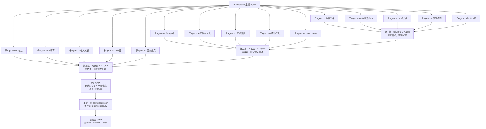

# 15 子 Agent 并行新闻生成配置

> **说明**：本配置文件定义如何通过 15 个子 Agent，并行执行 `task/morning_news/` 目录下的 15 个新闻板块任务，一次性生成完整早间新闻。

> **更新时间**：2026-05-14（v3.0：精简为15个模块，重新分类编号）

---

## 🎯 整体设计

### 执行日期
| 参数 | 值 |
|------|------|
| `{DATE}` | 2026-05-14（周四） |
| `{DATE-1}` | 2026-05-13（周三） |
| `{DATE-2}` | 2026-05-12（周二） |
| `{YYYYMM}` | 202605 |
| `{YYYYMMDD}` | 20260514 |
| **搜索时段** | 2026-05-13 07:00 ~ 2026-05-14 07:00（24小时） |
| **输出根目录** | `news/{YYYYMM}/{YYYYMMDD}/` |

### 执行策略（分 3 批，避免 API 限流）

每批内的 Agent **同时启动**，批间 **等待前一批全部完成** 再启动下一批：

1. **第一批（新闻类 5 个）**：01 今日头条、03 AI与前沿科技、08 AI知识点、14 国际视野、15 财经市场 — 优先覆盖时效性最高的新闻
2. **第二批（开发类 5 个）**：02 科技热点、04 开发者工具、05 开发语言、06 移动开发、07 GitHubSkills — 开发者生态内容
3. **第三批（知识类 5 个）**：09 AI创业、10 AI教育、11 个人成长、12 AI产品、13 国内热点 — 知识类/轻量内容

### 前置步骤
```bash
# 创建输出目录（统一执行一次）
mkdir -p {workspace}/news/{YYYYMM}/{YYYYMMDD}
```

### 执行流程图


### 后置步骤（全部 Agent 完成后执行）
```bash
# 1. 验证完整性：确认 15 个文件全部生成
ls news/{YYYYMM}/{YYYYMMDD}/ | wc -l
# 应输出 15

# 2. 重新生成新闻索引，供前端页面加载
python3 scripts/gen-news-index.py

# 3. 提交到 Gitee（自动上传，无需手动操作）
git add news/ news-index.json
git commit -m "{DATE} 早间新闻（15板块）"
git push gitee main

# 4. 输出确认
echo "✅ 早间新闻生成完成，共 15 篇，已推送至 Gitee"
```

---

## 🧩 子 Agent 定义（共 15 个）

### 通用执行规则（所有 Agent 共享）

1. **先搜索，再写作**：每个 Agent 必须先执行联网搜索，严禁凭记忆生成内容
2. **全量搜索原则**：各任务文件中的每个子领域关键词必须逐一执行，不得跳跃
3. **核实关键数据**：所有数字类信息必须通过第二次搜索确认
4. **严格基于搜索结果**：不得在搜索结果之外自行添加细节
5. **信息来源必填**：每条新闻末尾标注真实来源（媒体名称 + 报道日期）
6. **自动填充日期**：将任务文件中的 `{DATE}`、`{DATE-1}`、`{DATE-2}`、`{YYYYMM}`、`{YYYYMMDD}` 替换为实际日期值
7. **分批执行**：15 个子 Agent 分 3 批执行，避免搜索 API 限流

### 通用跨模块去重规则（对所有 Agent 强制）

| 事件类型 | 归属模块（主角度） | 其他模块若涉及则切入角度 |
|---------|------------------|----------------------|
| 商业/公司动态 | 02_科技热点 | 03→只谈技术原理，不谈商业合作/投资 |
| 学术/技术突破 | 03_AI与前沿科技 | 02→只谈行业影响，不谈技术细节 |
| AI开发工具/框架 | 04_开发者工具 | 03→只谈底层技术趋势，不谈工具选型 |
| 语言版本发布 | 05_开发语言 | 06→只谈该语言在本生态的影响，不报道版本本身 |
| 移动端开发技术 | 06_移动开发 | 03→只谈底层AI技术，不谈开发框架 |
| AI开源项目 | 07_GitHubSkills | 04→只谈开源项目代码，不谈使用体验 |
| AI商业变现/创业案例 | 09_AI创业 | 03→只谈技术突破不谈商业 |
| AI+教育落地/灵感 | 10_AI教育 | 03→只谈技术不谈教育场景 |
| 个人提升/自我成长 | 11_个人成长 | 09→只谈赚钱不谈个人成长 |
| AI产品管理/设计 | 12_AI产品 | 03→只谈技术不谈产品 |
| 国内时政/民生 | 13_国内热点 | 01→只纳入头条级事件 |
| 国际政治/财经 | 14_国际视野 / 15_财经市场 | 01→只纳入头条级事件 |

---

## 🤖 Agent 任务文件清单（共 15 个）

| 编号 | 任务文件 | 分类 | 新闻条数 | 输出文件 |
|------|---------|------|---------|---------|
| 01 | 01_今日头条.md | 今日热点 | 4-6条 | 01_今日头条.md |
| 02 | 02_科技热点.md | 科技动态 | 5-8条 | 02_科技热点.md |
| 03 | 03_AI与前沿科技.md | 科技前沿 | 6-10条 | 03_AI与前沿科技.md |
| 04 | 04_开发者工具.md | 开发工具 | 6-10条 | 04_开发者工具.md |
| 05 | 05_开发语言.md | 开发语言 | 4-6条 | 05_开发语言.md |
| 06 | 06_移动开发.md | 移动开发 | 8-12条 | 06_移动开发.md |
| 07 | 07_GitHubSkills.md | 开源项目 | 5-8条 | 07_GitHubSkills.md |
| 08 | 08_AI知识点.md | AI知识 | 6-10条 | 08_AI知识点.md |
| 09 | 09_AI创业.md | AI创业 | 5-8条 | 09_AI创业.md |
| 10 | 10_AI教育.md | AI教育 | 4-6条 | 10_AI教育.md |
| 11 | 11_个人成长.md | 个人成长 | 4-6条 | 11_个人成长.md |
| 12 | 12_AI产品.md | AI产品 | 4-6条 | 12_AI产品.md |
| 13 | 13_国内热点.md | 国内资讯 | 4-6条 | 13_国内热点.md |
| 14 | 14_国际视野.md | 国际视野 | 4-6条 | 14_国际视野.md |
| 15 | 15_财经市场.md | 财经市场 | 4-6条 | 15_财经市场.md |

---

## 📋 分批执行指南

### 第一批（新闻类 5 个）- 同时启动

| Agent | 任务文件 | 重量级 | max_turns |
|-------|---------|--------|-----------|
| 01 | 01_今日头条.md | 重量级 | 80 |
| 03 | 03_AI与前沿科技.md | 重量级 | 120 |
| 08 | 08_AI知识点.md | 中量级 | 100 |
| 14 | 14_国际视野.md | 中量级 | 80 |
| 15 | 15_财经市场.md | 中量级 | 80 |

### 第二批（开发类 5 个）- 等待第一批完成后启动

| Agent | 任务文件 | 重量级 | max_turns |
|-------|---------|--------|-----------|
| 02 | 02_科技热点.md | 重量级 | 120 |
| 04 | 04_开发者工具.md | 重量级 | 120 |
| 05 | 05_开发语言.md | 轻量级 | 60 |
| 06 | 06_移动开发.md | 中量级 | 100 |
| 07 | 07_GitHubSkills.md | 中量级 | 100 |

### 第三批（知识类 5 个）- 等待第二批完成后启动

| Agent | 任务文件 | 重量级 | max_turns |
|-------|---------|--------|-----------|
| 09 | 09_AI创业.md | 轻量级 | 60 |
| 10 | 10_AI教育.md | 轻量级 | 60 |
| 11 | 11_个人成长.md | 轻量级 | 60 |
| 12 | 12_AI产品.md | 轻量级 | 60 |
| 13 | 13_国内热点.md | 中量级 | 80 |

---

## 📝 各 Agent 核心约束速查

### Agent 01-03（新闻类）
- 必须联网搜索后才能写
- 每条末尾标注真实信息来源
- 与其他模块严格区分定位

### Agent 04-07（开发类）
- 聚焦技术实践和开发工具
- 禁止与 03 重复（不谈AI底层原理）
- 每条末尾标注信息来源

### Agent 08（AI知识点）
- 适用知识类文档跨时序去重规则
- 搜索窗口 7 天（{DATE-7} 至 {DATE}）
- 按轮换表聚焦当日子领域

### Agent 09-12（知识类）
- 适用知识类文档跨时序去重规则
- 搜索窗口 7 天
- 执行前读取最近 7 天历史

### Agent 13-15（资讯类）
- 必须联网搜索后才能写
- 每条末尾标注真实信息来源
- 禁止与 01 重复相同事件

---

## 🔗 分类对照表

| 分类 | Agent 编号 | 定位 |
|------|-----------|------|
| **今日热点** | 01 | 今日头条级事件汇总 |
| **科技动态** | 02 | 科技行业动态 |
| **科技前沿** | 03 | AI与前沿技术突破 |
| **开发工具** | 04 | AI开发框架与工具 |
| **开发语言** | 05 | 编程语言动态 |
| **移动开发** | 06 | iOS/Android/HarmonyOS/跨平台 |
| **开源项目** | 07 | GitHub优质项目 |
| **AI知识** | 08 | AI知识点深度解读 |
| **AI创业** | 09 | AI变现与创业案例 |
| **AI教育** | 10 | AI+教育落地方案 |
| **个人成长** | 11 | 个人能力提升方法 |
| **AI产品** | 12 | AI产品设计与方法论 |
| **国内资讯** | 13 | 国内政策与民生 |
| **国际视野** | 14 | 国际局势与地缘政治 |
| **财经市场** | 15 | 全球股市与经济数据 |

---

## 📋 验证清单

1. **全量搜索验证**：随机抽查 2-3 个关键词，确认搜索结果中有该时间窗口内的真实新闻
2. **文件完整性检查**：检查 15 个文件是否全部存在且非空
3. **内容质量检查**：
   - 每条新闻是否有信息来源标注
   - 每条新闻是否有实质内容（非标题党）
   - 是否存在跨模块重复报道
4. **知识类模块专项检查**：
   - 是否读取了最近 7 天历史文件
   - 是否避免与历史内容重复

---

*生成时间：2026-05-14 | 最后更新：2026-05-14（v3.0：精简为15模块，重新分类编号）*
