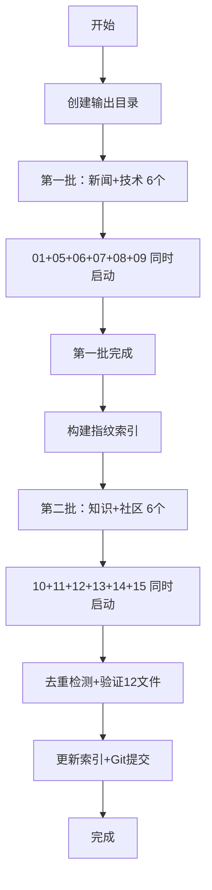

# 12 子 Agent 并行新闻生成配置

> **说明**：本配置文件定义如何通过 12 个子 Agent，并行执行 `task/morning_news/` 目录下的 12 个新闻板块任务。**模块 02/03/04 已暂停生成**。

> **更新时间**：2026-06-01（v4.1：暂停02/03/04，调整为2批执行，当前12个模块）

---

## 🎯 整体设计

### 执行日期
> **说明**：以下变量由 `run-morning-news.py` 脚本自动替换为当天日期，无需手动修改

| 参数 | 变量 | 说明 |
|------|------|------|
| `{DATE}` | 自动 | 今天日期（如：2026-05-16） |
| `{DATE-1}` | 自动 | 昨天日期 |
| `{DATE-7}` | 自动 | 7天前日期 |
| `{DATE-30}` | 自动 | 30天前日期 |
| `{YYYYMM}` | 自动 | 年月（如：202605） |
| `{YYYYMMDD}` | 自动 | 年月日（如：20260516） |
| **输出根目录** | 自动 | `news/{YYYYMM}/{YYYYMMDD}/` |

### 📦 P0优化工具

| 工具 | 路径 | 作用 |
|:----|:-----|:-----|
| **一键执行脚本** | `scripts/run-morning-news.py` | 自动创建目录、清缓存、生成Agent提示、验证、索引、提交 |
| **搜索缓存** | `scripts/search-cache.py` | 缓存搜索结果，相同关键词只搜一次，节省30-40%搜索开销 |
| **知识索引** | `scripts/manage-knowledge.py` | 知识类模块去重管理 |

> **使用方式**：先运行 `python3 scripts/run-morning-news.py --date {DATE}` 生成执行计划，再将生成的2批Agent提示交给AI依次执行。

### 执行策略（分 2 批，避免 API 限流）

每批内的 Agent **同时启动**，批间 **等待前一批全部完成** 再启动下一批：

1. **第一批（新闻+技术 6 个）**：01、05、06、07、08、09 — 新闻与科技深度内容
2. **第二批（知识+社区 6 个）**：10、11、12、13、14、15 — 开源、移动开发与知识沉淀

### 前置步骤
```bash
python3 scripts/run-morning-news.py --date {DATE}
```

### 执行流程图


### 后置步骤（全部 Agent 完成后执行）

```bash
# 1. 验证完整性：确认 12 个文件全部生成
ls news/{YYYYMM}/{YYYYMMDD}/ | wc -l   # 应输出 12

# 2. 运行内容去重检测
python3 scripts/check-dedup.py scan {DATE}

# 3. 更新内容指纹索引
python3 scripts/check-dedup.py build-index {DATE}

# 4. 重新生成前端索引
python3 scripts/gen-news-index.py

# 5. 提交到双远端
git add news/ news-index.json task/knowledge-index*.json
git commit -m "{DATE} 早间新闻（12板块，02/03/04暂停）"
git push

# 6. 输出确认
echo "✅ 早间新闻生成完成，共 12 篇，已推送至 Gitee & GitHub"
```

---

## 🧩 子 Agent 定义（共 15 个）

### 通用执行规则（所有 Agent 共享）

1. 先加载 `任务基础模板.md` 获取通用规范
2. 再加载各自模块文件获取差异化内容
3. 先搜索，再写作，严禁凭记忆生成
4. 全量搜索：每个关键词逐一执行，不得跳跃
5. 核实关键数据：数字类信息二次搜索确认
6. 信息来源必填（媒体名称 + 报道日期）
7. 自动填充日期变量（{DATE}/{DATE-7}/{DATE-30}/{YYYYMM}/{YYYYMMDD}）
8. 🔴 逐条写+即时保存：写一条存一条，防中断丢失
9. 🔴 知识类模块执行 L1-L4 层级（每周 ≥2 个层级）
10. 🔴 跨日期关联：同主题历史文章文末追加 📚 系列阅读链接

### 通用跨模块去重规则

| 事件类型 | 归属模块 | 其他模块切入角度 |
|---------|---------|----------------|
| 商业/公司动态 | 06_科技动态 | 05→只谈技术原理 |
| 学术/技术突破 | 05_科技前沿 | 06→只谈行业影响 |
| AI开发工具/框架 | 10_GitHubSkills | 08→只谈代码 |
| 语言版本发布 | 09_开发语言 | 11→只谈生态影响 |
| AI设计方法论 | 02_AI与设计创意 | 08→只谈工具操作 |
| 数据工程/ML Pipeline | 03_AI与数据工程 | 07→只谈算法原理 |
| 工具/书籍推荐 | 04_技术精选推荐 | 10→只谈代码 |

---

## 🤖 Agent 任务文件清单（共 15 个）

| 编号 | 任务文件 | 分类 | 条数 | 输出文件 |
|------|---------|------|:--:|---------|
| 01 | 01_新闻早报.md | 新闻早报 | 8-12 | 01_今日头条.md |
| 02 | 02_AI与设计创意.md | AI设计 | 5-7 | 02_AI与设计创意.md |
| 03 | 03_AI与数据工程.md | 数据工程 | 5-7 | 03_AI与数据工程.md |
| 04 | 04_技术精选推荐.md | 精选推荐 | 6-8 | 04_技术精选推荐.md |
| 05 | 05_科技前沿.md | 科技前沿 | 5-8 | 05_科技前沿.md |
| 06 | 06_科技动态.md | 科技动态 | 5-8 | 06_科技动态.md |
| 07 | 07_AI知识点.md | AI知识 | 6-8 | 07_AI知识点.md |
| 08 | 08_AI工具使用.md | AI工具 | 6-8 | 08_AI工具使用.md |
| 09 | 09_开发语言.md | 开发语言 | 6-8 | 09_开发语言.md |
| 10 | 10_GitHubSkills.md | GitHub | 6-8 | 10_GitHubSkills.md |
| 11 | 11_移动开发.md | 移动开发 | 5-8 | 11_移动开发.md |
| 12 | 12_AI创业.md | AI创业 | 5-8 | 12_AI创业.md |
| 13 | 13_AI教育.md | AI教育 | 6-8 | 13_AI教育.md |
| 14 | 14_个人成长.md | 个人成长 | 6-8 | 14_个人成长.md |
| 15 | 15_AI产品经理.md | AI产品 | 6-8 | 15_AI产品经理.md |

---

## 📋 分批执行指南

### 第一批（新闻+技术 6 个）

| Agent | 任务文件 | 重量级 | max_turns |
|-------|---------|--------|:--:|
| 01 | 01_新闻早报.md | 特重量级 | 160 |
| 05 | 05_科技前沿.md | 重量级 | 120 |
| 06 | 06_科技动态.md | 重量级 | 120 |
| 07 | 07_AI知识点.md | 中量级 | 100 |
| 08 | 08_AI工具使用.md | 轻量级 | 60 |
| 09 | 09_开发语言.md | 轻量级 | 60 |

### 第二批（知识+社区 6 个）

| Agent | 任务文件 | 重量级 | max_turns |
|-------|---------|--------|:--:|
| 10 | 10_GitHubSkills.md | 中量级 | 80 |
| 11 | 11_移动开发.md | 中量级 | 100 |
| 12 | 12_AI创业.md | 轻量级 | 60 |
| 13 | 13_AI教育.md | 轻量级 | 60 |
| 14 | 14_个人成长.md | 轻量级 | 60 |
| 15 | 15_AI产品经理.md | 轻量级 | 60 |

---

## 📝 各 Agent 核心约束速查

### Agent 01（新闻早报）
- 覆盖头条+国内+国际+财经四大领域
- 每条末尾标注真实信息来源

### Agent 02-03-04（新增板块）
- 02 聚焦 AI 设计方法论与创意实践，与 08（工具操作）严格区分
- 03 聚焦数据工程与 ML Pipeline 架构，与 07（算法原理）严格区分
- 04 全站精华聚合入口，短清单格式每周好书/论文/工具/文章推荐

### Agent 05-06（科技类）
- 05 专注技术突破，不报道商业动态
- 06 报道商业动态，不深入技术细节

### Agent 07-11（技术深度类）
- 07 AI 知识点深度解读，主题池动态选
- 08 AI 工具使用技巧与实战教程
- 09 编程语言版本与新特性
- 10 GitHub Trending 优质项目
- 11 移动端全生态开发技术

### Agent 12-15（知识沉淀类）
- 适用跨时序去重规则，主题池动态选
- 搜索窗口 30 天，执行前读最近 7 天历史
- 选题时标注 L1-L4 层级，每周 ≥2 个层级

---

## 🔗 分类对照表

| 分类 | Agent | 定位 |
|------|:--:|------|
| 新闻早报 | 01 | 头条+国内+国际+财经 |
| AI设计 | 02 | AI时代的设计方法论与创意实践 |
| 数据工程 | 03 | 数据管道、ML Pipeline 工程实践 |
| 精选推荐 | 04 | 每周好书/论文/工具/文章聚合 |
| 科技前沿 | 05 | AI与前沿技术突破 |
| 科技动态 | 06 | 科技行业商业动态 |
| AI知识 | 07 | AI技术知识点深度解读 |
| AI工具 | 08 | AI工具使用技巧与教程 |
| 开发语言 | 09 | 编程语言版本与新特性 |
| GitHub | 10 | GitHub Trending 开源项目 |
| 移动开发 | 11 | iOS/Android/HarmonyOS/跨平台 |
| AI创业 | 12 | AI变现与创业案例 |
| AI教育 | 13 | AI+教育落地方案 |
| 个人成长 | 14 | 个人能力提升方法论 |
| AI产品 | 15 | AI产品设计与产品管理 |

---

## 📋 验证清单

1. 全量搜索验证：随机抽查 2-3 个关键词确认有真实搜索结果
2. 文件完整性检查：12 个文件全部存在且非空
3. 内容质量检查：来源标注、实质内容、无跨模块重复
4. 知识类模块专项：读最近 7 天历史、避免重复、≥2 个 L1-L4 层级、同主题跨日期关联

---

*最后更新：2026-05-23（v4.0：15板块，分3批执行）*
