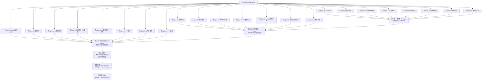

# 23 子 Agent 并行新闻生成配置

> **说明**：本配置文件定义如何通过 23 个子 Agent，并行执行 `task/morning_news/` 目录下的 23 个新闻板块任务，一次性生成完整早间新闻。

---

## 🎯 整体设计

### 执行日期
| 参数 | 值 |
|------|------|
| `{DATE}` | 2026-05-14（周四） |
| `{DATE-1}` | 2026-05-13（周三） |
| `{DATE-2}` | 2026-05-12（周二） |
| `{YYYYMM}` | 202605 |
| `{YYYYMMDD}` | 20260514 |
| **搜索时段** | 2026-05-13 07:00 ~ 2026-05-14 07:00（24小时） |
| **输出根目录** | `news/{YYYYMM}/{YYYYMMDD}/` |

### 执行策略（分 3 批，避免 API 限流）

每批内的 Agent **同时启动**，批间 **等待前一批全部完成** 再启动下一批：

1. **第一批（新闻类 8 个）**：01, 02, 03, 10, 14, 15, 16, 17 — 优先覆盖时效性最高的新闻
2. **第二批（开发者类 7 个）**：04, 05, 06, 07, 08, 09, 11 — 开发者生态内容
3. **第三批（知识类 8 个）**：12, 13, 18, 19, 20, 21, 22, 23 — 知识类内容（7天窗口，不依赖当日其他模块输出）

### 前置步骤
```bash
# 创建输出目录（统一执行一次）
mkdir -p {workspace}/news/{YYYYMM}/{YYYYMMDD}
```

### 执行流程图


### 后置步骤（全部 Agent 完成后执行）
```bash
# 1. 验证完整性：确认 23 个文件全部生成
ls news/{YYYYMM}/{YYYYMMDD}/ | wc -l
# 应输出 23

# 2. 重新生成新闻索引，供前端页面加载
python3 scripts/gen-news-index.py

# 3. 提交到 Gitee（自动上传，无需手动操作）
git add news/ news-index.json
git commit -m "{DATE} 早间新闻（23板块）"
git push gitee main

# 4. 输出确认
echo "✅ 早间新闻生成完成，共 23 篇，已推送至 Gitee"
```

---

## 🧩 子 Agent 定义（共 22 个）

### 通用执行规则（所有 Agent 共享）

1. **先搜索，再写作**：每个 Agent 必须先执行联网搜索，严禁凭记忆生成内容
2. **全量搜索原则**：各任务文件中的每个子领域关键词必须逐一执行，不得跳跃
3. **核实关键数据**：所有数字类信息必须通过第二次搜索确认
4. **严格基于搜索结果**：不得在搜索结果之外自行添加细节
5. **信息来源必填**：每条新闻末尾标注真实来源（媒体名称 + 报道日期）
6. **自动填充日期**：将任务文件中的 `{DATE}`、`{DATE-1}`、`{DATE-2}`、`{YYYYMM}`、`{YYYYMMDD}` 替换为实际日期值
7. **分批执行**：22 个子 Agent 分 3 批执行，每批间隔 30 秒，避免搜索 API 限流
   - **第一批（8 个新闻类）**：01 今日头条、02 科技热点、03 AI与前沿科技、14 产品发布、15 国内热点、16 国际大事件、17 财经市场、10 移动端生态
   - **第二批（7 个开发者类）**：04 软件开发、05 开发语言、06 华为、07 iOS、08 Android、09 跨平台、11 AI开发生态
   - **第三批（7 个知识/工具类）**：12 GitHub Skills、13 AI知识点、18 AI工具使用、19 商业变现、20 AI+教育、21 个人提升、22 AI产品经理

### 通用跨模块去重规则（对所有 Agent 强制）

**按事件类型划定"归属模块"与"其他模块切入角度"——切入不对则内容必重复：**

| 事件类型 | 归属模块（主角度） | 其他模块若涉及则切入角度 |
|---------|------------------|----------------------|
| 商业/公司动态 | 02_科技热点 | 03→只谈技术原理，不谈商业合作/投资；04→只谈开发者工具链影响 |
| 学术/技术突破 | 03_AI与前沿科技 | 02→只谈行业影响，不谈技术细节 |
| AI开发工具/框架 | 04_软件开发 / 11_AI开发生态 | 03→只谈底层技术趋势，不谈工具选型 |
| 语言版本发布 | 05_开发语言 | 07/08/11→只谈该语言在本生态的影响，不报道版本本身 |
| 移动端产品 | 14_产品发布 | 02/10→只谈行业影响和趋势，不重复产品参数、价格、规格 |
| AI工具使用技巧 | 18_AI工具使用 | 11→只谈工具SDK/API开发，不谈用户端使用；12→只谈开源项目本身，不谈使用体验 |
| AI商业变现/创业案例 | 19_商业思维与AI变现 | 03→只谈技术突破不谈商业；14→只谈产品参数不谈商业模式；17→只谈大盘数据不谈具体方案 |
| AI+教育落地/灵感 | 20_AI+教育落地与灵感 | 03→只谈技术不谈教育场景；14→只谈产品不谈教学方案；18→只谈通用用法不谈教育场景特定用法 |
| 个人提升/自我成长 | 21_个人提升 | 18→只谈工具不谈个人能力；19→只谈赚钱不谈个人成长；20→只谈教育场景不谈个人自主提升 |
| AI产品管理/设计 | 22_AI产品经理 | 03→只谈技术不谈产品；13→只谈概念不谈实践；18→只谈工具操作不谈产品设计；19→只谈赚钱不谈产品方法论 |
| 一人公司/独立创业 | 23_一人公司 | 18→只谈工具不谈赚钱模式；19→只谈企业级方案不谈个人轻量方案；21→只谈个人能力不谈创业实操 |
| 移动生态趋势 | 10_移动端生态 | 02/08→只引用结果数据，不展开分析 |
| 国际政治/财经 | 16_国际大事件 / 17_财经市场 | 01→只纳入头条级事件，且从"综合影响"角度 |
| 国内时政/民生 | 15_国内热点 | 01→只纳入头条级事件 |

> **执行原则**：写作前自查计划中的事件类型是否属于其他模块的主领域。若是，切换本模块的切入角度（只覆盖"层"不覆盖"核"）或跳过。**宁缺毋滥，不重复报道同一件事的同一层面。**

### 知识类文档跨时序去重规则（仅对知识/学习类模块强制）

> **核心问题**：知识类内容（AI知识点、工具使用、教育方案、个人提升、产品方法论）具有**知识稳定性**——RAG 原理不会每天变、时间管理方法不会每天变。如果每天只换角度讲同样的知识点，对读者就是重复阅读，失去价值。
>
> **根因分析**：当前各 Agent 独立执行，不读取前几日的历史输出，且搜索窗口只有 24 小时。对于稳定知识类话题，24 小时内社区讨论变化极有限，导致连续多日产出同质内容。
>
> **改进方案**：知识类模块的搜索窗口从 24 小时扩展至 **7 天（{DATE-7} 07:00 → {DATE} 07:00）**。知识是不过时的，能够持续讨论 7 天的概念才真正值得收录。同时配合轮换制（规则二）+ 深度递进（规则三），确保每周覆盖子领域全面但无重复。

以下规则适用于 **Agent 13（AI知识点）、Agent 18（AI工具使用）、Agent 20（AI+教育）、Agent 21（个人提升）、Agent 22（AI产品经理）、Agent 23（一人公司）** 共 6 个知识/学习类模块：

#### 规则一：执行前读取历史（必读前 N 天）

执行本模块前，**必须先读取最近 7 天的历史输出文件**，建立"已覆盖主题黑名单"：

| 模块 | 历史读取路径（最近 7 天） | 读取内容 |
|------|--------------------------|---------|
| 13_AI知识点 | `news/{YYYYMM}/{YYYYMMDD-1~7}/13_AI知识点.md` | 每条知识点的**标题和核心概念名** |
| 18_AI工具使用 | `news/{YYYYMM}/{YYYYMMDD-1~7}/18_AI工具使用.md` | 每条的工具名称和核心功能 |
| 20_AI+教育 | `news/{YYYYMM}/{YYYYMMDD-1~7}/20_AI+教育落地与灵感.md` | 每条的教育场景和AI方案名称 |
| 21_个人提升 | `news/{YYYYMM}/{YYYYMMDD-1~7}/21_个人提升.md` | 每条的核心方法/概念名称 |
| 22_AI产品经理 | `news/{YYYYMM}/{YYYYMMDD-1~7}/22_AI产品经理.md` | 每条的产品方法论/案例名称 |
| 23_一人公司 | `news/{YYYYMM}/{YYYYMMDD-1~7}/23_一人公司.md` | 每条的模式名称和核心数据 |

> 若某天文件不存在（如刚新增模块），则跳过该天；至少读取到 3 天有效历史文件。

#### 规则二：混合轮换制（7 天一轮换，聚焦+广度兼顾）

知识类模块采用 **先全量搜索 → 按轮换分配输出量** 的混合模式：

1. **每天全量搜索所有子领域**：按搜索关键词列表，逐个子领域、逐个关键词完成搜索，确保不遗漏当天的突发热点
2. **按轮换表分配写作量**：当天聚焦方向写 **4-8 条深度条目**，其余方向合写 **1-3 条**（广度兜底），具体条数按各模块细则执行
3. **输出总量**：按各模块细则执行，**质量优先于数量**
4. 若当天聚焦子领域全量搜索后无新热点，可**横向扩展相邻子领域**，需在文件头部标注"本期扩展覆盖"

**13_AI知识点 — 子领域轮换表：**

| 日期 | 轮换组 | 聚焦子领域 |
|------|--------|-----------|
| 周一 | 组 A | Agent与工具调用（MCP、Function Calling、多Agent） |
| 周二 | 组 B | RAG与知识检索（GraphRAG、Embedding、向量数据库） |
| 周三 | 组 C | 大模型核心原理（Transformer、MoE、推理优化、量化） |
| 周四 | 组 D | Prompt工程 + 微调与定制化（LoRA、指令微调） |
| 周五 | 组 E | 多模态 + AI工程化（VLM、Diffusion、推理服务化） |
| 周六 | 组 F | AI安全与伦理（对齐、越狱防御、可解释性） |
| 周日 | 组 G | 本周 7 天热点回顾 + 最火知识点精选混编 |

- **每天先全量搜索**（8 个子领域所有关键词），然后按轮换分配：聚焦子领域 **写 4-6 条深度条目**，其余子领域合选 **1-3 条**，总计 **6-10 条**
- 若当天聚焦子领域全量搜索后无新热点，可**横向扩展到相邻子领域**（如组A没内容→扩展到组B），需在文件头部标注"本期扩展覆盖"
- **周日**：搜 `"本周 AI 最热知识点 总结 {DATE-7}至{DATE}"` 等综合关键词，从 7 天积累中选最热的 6-10 条深度撰写，不限制具体子领域

**18_AI工具使用 — 类别轮换表：**

| 日期 | 轮换组 | 聚焦方向 |
|------|--------|---------|
| 周一 | 组 A | **编程类 + 自动化工作流类**（开发者开工组合拳） |
| 周二 | 组 B | **对话类 + 搜索类**（日常效率利器） |
| 周三 | 组 C | **创作设计类 + 音视频类**（创意落地与内容制作） |
| 周四 | 组 D | **办公文档类 + 会议沟通类**（职场专业增效） |
| 周五 | 组 E | **学习类 + 国产AI工具专题**（自我提升） |
| 周六 | 组 F | **独立开发与变现工具**（创造价值，自己做产品） |
| 周日 | 组 G | **本周最佳工具回顾 + 实战项目构建**（从想法到产品） |

- **编程类**为 P0 每日必覆盖：每天「其余子领域」合选 3-5 条中优先包含编程类工具，确保 iOS 开发者每天都有编程提效内容
- **周六**：聚焦独立开发者的赚钱工具——App Store 上架、营销获客、订阅管理、ASO、AI 辅助创业等
- **周日**：搜 `"AI工具 本周 热门 推荐 {DATE-7}至{DATE}"` 等汇总关键词 + 实战场景项目搭建步骤

**20_AI+教育落地 — 方向轮换表：**

> **注**：国内案例为主（60-80%），国际案例为辅（20-40%）。国际案例嵌入每日内容中作为对照参考，周日集中展示国际最佳实践。

| 日期 | 轮换组 | 聚焦方向 |
|------|--------|---------|
| 周一 | 组 A | 政策动态（国内为主，参考国际教育AI政策趋势） |
| 周二 | 组 B | AI+教育落地案例（国内教学实践 + 海外学校对标案例） |
| 周三 | 组 C | 低成本创意方案（国内工具 + 国际教育工具本地化适配） |
| 周四 | 组 D | 学科教学（语数英科，国内教法 + 国际学科AI应用对照） |
| 周五 | 组 E | 家庭教育 + 自习备考（国内场景 + 海外家庭教育AI方案参照） |
| 周六 | 组 F | 职业教育 + 终身学习（国内 + 国际Coursera/edX等平台AI进展） |
| 周日 | 组 G | 本周灵感汇总 + 国际AI教育最佳实践专题 |

**21_个人提升 — 方向轮换表：**

| 日期 | 轮换组 | 聚焦方向 |
|------|--------|---------|
| 周一 | 组 A | 学习能力 + 知识管理 |
| 周二 | 组 B | 效率提升 + 时间管理 |
| 周三 | 组 C | 职业发展 + 技能提升 |
| 周四 | 组 D | 思维模型 + 认知升级 |
| 周五 | 组 E | 习惯养成 + 自律 |
| 周六 | 组 F | 人际沟通 + 创造力 |
| 周日 | 组 G | 优质资源推荐 + 本周回顾 |

**22_AI产品经理 — 方向轮换表：**

| 日期 | 轮换组 | 聚焦方向 |
|------|--------|---------|
| 周一 | 组 A | AI产品思维 + 方法论 |
| 周二 | 组 B | AI产品案例拆解 |
| 周三 | 组 C | AI产品技术理解（PM视角） |
| 周四 | 组 D | AI产品经理工具与工作流 |
| 周五 | 组 E | AI产品运营 + 增长 |
| 周六 | 组 F | AI产品全球化 + 出海 |
| 周日 | 组 G | 职业发展 + 学习路径 |

> **执行说明**：日期按星期计算（如 2026-05-14 周四→组 D）。采用混合轮换制——先全量搜索所有方向的关键词，再按当天轮换组分配写作量。

#### 规则三：同类不同层（已覆盖主题的深度递进策略）

从历史读取中发现某个主题**已被覆盖过**，但搜索到的当日热点又恰好与该主题相关，则采用**深度递进**而非重复讲解：

| 层级 | 切入角度 | 示例（以"RAG"为例） |
|------|---------|-------------------|
| **L1 概念层**（第一周） | 是什么、解决什么问题、与什么不同 | "RAG 的原理与入门" |
| **L2 技术层**（第二周） | 内部机制、关键参数、优化策略 | "RAG 的分块策略与重排序优化" |
| **L3 实践层**（第三周） | 生产级方案、踩坑经验、数据对比 | "百万级文档 RAG 系统的 6 个坑与解决方案" |
| **L4 前沿层**（第四周） | 最新演进、与传统方案的融合 | "GraphRAG + 传统 RAG 双通道混合检索方案" |

> **执行方法**：若历史黑名单中发现相同概念，先判断之前是哪一层→当天写下一层→标题注明"[深度] "或"[进阶] "前缀。若已到 L4，则**彻底跳过**该主题。

#### 规则四：跨模块同日黑名单（同一模块内的内容不再同日出现在其他知识模块）

知识类模块之间常出现同一话题在同一天被多个模块覆盖（如"用 AI 学英语"可能同时出现在 18、20、21）。追加规则：

| 编写模块 | 可写场景 | 须跳过的重叠场景 |
|---------|---------|----------------|
| 18_AI工具使用（写某工具） | 工具的操作技巧 | 20 若同日也在写同一工具的**教育场景用法**→18 跳过该工具的教育用法部分 |
| 20_AI+教育落地（写某方案） | 教育场景的落地方案 | 21 若同日也在写同一方法的**个人提升用法**→20 跳过该方法的个人使用部分 |
| 21_个人提升（写某方法） | 个人能力提升操作 | 18 若同日也在写该方法的**工具操作**→21 跳过工具操作细节 |
| 22_AI产品经理（写某案例） | 产品设计和管理分析 | 18 若同日也在写该产品的**使用技巧**→22 跳过使用操作部分 |
| 23_一人公司（写某模式） | 一人创业实操方案 | 18 若同日也在写同一工具的**用法**→23 跳过工具操作细节；19 若同日也在写同一**商业模式**→23 跳过企业级方案；21 若同日也在写同一**方法**→23 跳过个人提升部分 |

> **执行方法**：每个知识类模块在搜索并确定候选条目后，写作前应快速检查**同日内其他知识模块的候选标题**（可通过约定的 scratchpad 或记事本中转），发现重叠则调整切入角度。

#### 规则五：条数灵活调整（宁缺毋滥）

- 若当天聚焦子领域在历史记录中已全部达到 L4（无可写新内容），且相邻子领域也无新热点：
  - 13_AI知识点：可降至 **4-5 条**，但每条必须写透（800-1200字/条）
  - 18_AI工具使用：可降至 **4-5 条**，但每条必须写透（800-1000字/条）
  - 12_GitHub实用Skills：可降至 **3-4 条**，但每条必须写透（800-1200字/条）
  - 19_商业思维与AI变现：可降至 **2-3 条**，但每条必须写透（800-1000字/条）
  - 20_AI+教育：可降至 **2-3 条**，但每条必须写透（800-1000字/条）
  - 21_个人提升：可降至 **3-4 条**，但每条必须写透（800-1000字/条）
  - 22_AI产品经理：可降至 **2-3 条**，但每条必须写透（800-1000字/条）
  - 23_一人公司：可降至 **2-3 条**，但每条必须写透（800-1000字/条）
- 输出文件头部需标注"本期缩减原因：聚焦子领域无可写新内容"
- **严禁降质凑数**——宁可只写 3 条透彻的，不要写 10 条重复的

#### 规则六：搜索窗口统一为 7 天（非 24 小时）

知识类模块与新闻类模块的关键区别：**知识不过时**。

- 知识类模块（13/18/20/21/22/23）的搜索窗口统一为 **`{DATE-7} 07:00 ~ {DATE} 07:00`（7天）**，而非新闻类模块的 24 小时
- 搜索关键词统一使用 `{DATE-7}至{DATE}` 追加
- **理由**：一个知识点/工具/方法能够持续被讨论 7 天，说明它是真正重要、有价值的内容。用 24 小时窗口搜知识类话题，往往搜不到足够深度的讨论（因为讨论是分散在数天内的）。7 天窗口结合轮换制，确保覆盖广、收录精
- 各知识类模块任务文件中的搜索关键词模板已全部更新为 `{DATE-7}至{DATE}`，Agent 直接使用即可
- **执行说明**：搜索时优先使用 7 天窗口一次覆盖，无需像新闻模块那样分多轮（当日/前日/深度）回溯

### 通用输出规范（所有 Agent 必须遵守）

1. **文件头部统一格式**：
   ```markdown
   # XX_模块名称
   
   > **生成日期**：{DATE} | **搜索时段**：{DATE-1} 07:00 ~ {DATE} 07:00
   > **总条数**：N 条 | **覆盖范围**：[简要说明]
   ```
2. **每条新闻统一结构**：
   ```
   ### N. 【标题】
   > 📍 导语（50字以内，说清核心信息）
   ---
   [深度报道内容]
   ---
   🤖 AI深度研判（可选）
   ---
   🔗 信息来源：媒体1（日期）/ 媒体2（日期）
   ---
   ```
3. **标题长度**：不超过 35 字，必须包含核心信息（主体+动作+数据）
4. **禁止套话**：禁止使用"具有重要意义""标志着新一轮浪潮"等空洞表述，必须用事实和数据说话
5. **全面深度要求（各模块基线，模块内细则可上浮）**：
   - **每条最低标准**：核心事实+背景+影响+来源（不能是简讯/快讯）
   - **各模块输出规范中若写明了结构要求**（如"技术全景→应用前景→竞争格局"），则按模块要求执行，不降级
6. **信息来源质量**：
   - 优先使用一级来源（官方公告/期刊论文/原始数据）
   - 其次使用权威媒体（新华社/路透/彭博/官方指定媒体）
   - 避免引用个人博客/知乎专栏作为主要来源（可作为辅助佐证）

---

### Agent 01 — 今日头条

| 项目 | 内容 |
|------|------|
| **任务文件** | `task/morning_news/01_今日头条.md` |
| **输出文件** | `news/{YYYYMM}/{YYYYMMDD}/01_今日头条.md` |
| **新闻条数** | 3-5 条（优先生成 5 条） |
| **搜索优先级** | P0: 政治类、经济类、国际类 → P1: 科技类、社会类、金融安全类 → P2: 其余子领域 |
| **输出格式** | 每条包含：标题、导语、深度报道（事件经过/背景溯源/各界反应/深度影响）、AI深度研判（短期趋势/行业传导链/风险预警/机会捕捉/行动建议）、信息来源 |

---

### Agent 02 — 科技热点

| 项目 | 内容 |
|------|------|
| **任务文件** | `task/morning_news/02_科技热点.md` |
| **输出文件** | `news/{YYYYMM}/{YYYYMMDD}/02_科技热点.md` |
| **新闻条数** | 5-8 条（优先生成 6-8 条） |
| **搜索优先级** | P0: AI/大模型、科技公司动态 → P1: 芯片半导体、互联网/APP → P2: 前沿科研、企业服务/SaaS、科技赋能传统行业、智能汽车 |
| **去重要求** | 与 03 模块严格区分（02 报道商业动态，03 报道技术突破） |

---

### Agent 03 — AI 与前沿科技

| 项目 | 内容 |
|------|------|
| **任务文件** | `task/morning_news/03_AI与前沿科技.md` |
| **输出文件** | `news/{YYYYMM}/{YYYYMMDD}/03_AI与前沿科技.md` |
| **新闻条数** | 5-8 条（优先生成 6-8 条） |
| **搜索优先级** | P0: 大模型进展、AI技术前沿 → P1: AI产业化、AI政策与伦理 → P2: 前沿科技、推理优化、AI安全与对齐 |
| **去重要求** | 与 02 模块严格区分（本模块专注技术突破本身，不报道商业动态） |

---

### Agent 04 — 软件开发

| 项目 | 内容 |
|------|------|
| **任务文件** | `task/morning_news/04_软件开发.md` |
| **输出文件** | `news/{YYYYMM}/{YYYYMMDD}/04_软件开发.md` |
| **新闻条数** | 3-6 条（优先生成 5-6 条） |
| **搜索优先级** | P0: AI开发框架与工具、移动端AI与开发 → P1: AI工程化与DevOps、开发者生态与社区 → P2: 新兴开发技术、系统架构、数据工程 |
| **去重要求** | 与 02/03 模块严格区分（本模块侧重开发者实践和工具选型） |

---

### Agent 05 — 开发语言

| 项目 | 内容 |
|------|------|
| **任务文件** | `task/morning_news/05_开发语言.md` |
| **输出文件** | `news/{YYYYMM}/{YYYYMMDD}/05_开发语言.md` |
| **新闻条数** | 3-5 条（优先生成 5 条） |
| **搜索优先级** | P0: Python生态、Java/JVM → P1: Web前端语言、Go/Rust/系统语言 → P2: Apple平台语言、多范式语言、新兴语言、语言趋势 |
| **去重要求** | 与 07/08/11 模块严格区分（语言版本发布归本模块，框架生态归对应模块） |

---

### Agent 06 — 华为开发生态

| 项目 | 内容 |
|------|------|
| **任务文件** | `task/morning_news/06_华为开发生态.md` |
| **输出文件** | `news/{YYYYMM}/{YYYYMMDD}/06_华为开发生态.md` |
| **新闻条数** | 4-6 条（优先生成 5-6 条） |
| **搜索优先级** | P0: HarmonyOS/NEXT、DevEco Studio & 工具链 → P1: 华为云AI服务、应用市场与生态、华为硬件生态 → P2: AI工具链与MindSpore、开源与社区 |

---

### Agent 07 — iOS 开发生态

| 项目 | 内容 |
|------|------|
| **任务文件** | `task/morning_news/07_iOS开发生态.md` |
| **输出文件** | `news/{YYYYMM}/{YYYYMMDD}/07_iOS开发生态.md` |
| **新闻条数** | 5-8 条（优先生成 6-8 条） |
| **覆盖范围** | Swift/SwiftUI/Xcode 工具链、App Store 政策、visionOS、Apple Intelligence、iOS 18+ 新功能、Swift 并发模型 |

---

### Agent 08 — Android 开发生态

| 项目 | 内容 |
|------|------|
| **任务文件** | `task/morning_news/08_Android开发生态.md` |
| **输出文件** | `news/{YYYYMM}/{YYYYMMDD}/08_Android开发生态.md` |
| **新闻条数** | 3-5 条（优先生成 5 条） |
| **覆盖范围** | Android OS/Google Play、Kotlin/Jetpack Compose、Android Studio、厂商定制层、Kotlin Multiplatform |

---

### Agent 09 — 跨平台开发生态

| 项目 | 内容 |
|------|------|
| **任务文件** | `task/morning_news/09_跨平台开发生态.md` |
| **输出文件** | `news/{YYYYMM}/{YYYYMMDD}/09_跨平台开发生态.md` |
| **新闻条数** | 3-5 条（优先生成 5 条） |
| **覆盖范围** | Flutter、React Native、Kotlin Multiplatform、uni-app/Taro、小程序生态 |

---

### Agent 10 — 移动端生态

| 项目 | 内容 |
|------|------|
| **任务文件** | `task/morning_news/10_移动端生态.md` |
| **输出文件** | `news/{YYYYMM}/{YYYYMMDD}/10_移动端生态.md` |
| **新闻条数** | 3-5 条（优先生成 5 条） |
| **覆盖范围** | iOS/Android/鸿蒙整体格局、折叠屏/可穿戴/车载、移动市场数据、端侧AI趋势 |

---

### Agent 11 — AI 开发生态

| 项目 | 内容 |
|------|------|
| **任务文件** | `task/morning_news/11_AI开发生态.md` |
| **输出文件** | `news/{YYYYMM}/{YYYYMMDD}/11_AI开发生态.md` |
| **新闻条数** | 5-8 条（优先生成 6-8 条） |
| **覆盖范围** | LLM应用开发(RAG/Agent)、AI IDE/编程助手、AI开发平台(OpenAI/百度/阿里)、AI推理部署工具 |

---

### Agent 12 — GitHub 实用 Skills

| 项目 | 内容 |
|------|------|
| **任务文件** | `task/morning_news/12_GitHub实用Skills.md` |
| **输出文件** | `news/{YYYYMM}/{YYYYMMDD}/12_GitHub实用Skills.md` |
| **新闻条数** | 3-6 条（优先 5 条透彻的） |
| **搜索优先级** | P0: AI与Agent工具、AI编程助手与IDE插件 → P1: 开发者效率工具、前端与全栈工具 → P2: 后端与基础设施、开源库/SDK、开发者工具箱、数据工程与AI Infra |
| **重点关注** | GitHub Trending 新晋热门项目、Star 飙升项目 |

---

### Agent 13 — AI 知识点

| 项目 | 内容 |
|------|------|
| **任务文件** | `task/morning_news/13_AI知识点.md` |
| **输出文件** | `news/{YYYYMM}/{YYYYMMDD}/13_AI知识点.md` |
| **知识条目数** | 4-6 条（优先 5 条透彻的，宁缺毋滥） |
| **搜索优先级** | **按轮换制执行**（详见上方"知识类文档跨时序去重规则二"）：根据当天星期几选择对应轮换组的子领域搜索，其他子领域跳过 |
| **定位** | 知识科普，非新闻事件，需附带动手实践要点 |
| **时序去重** | 执行前必读 history/13_AI知识点 最近7天历史；按轮换表聚焦当日子领域；同主题深度递进（L1→L4）；跨模块同日检查 |

---

### Agent 14 — 产品发布

| 项目 | 内容 |
|------|------|
| **任务文件** | `task/morning_news/14_产品发布.md` |
| **输出文件** | `news/{YYYYMM}/{YYYYMMDD}/14_产品发布.md` |
| **新闻条数** | 3-6 条（优先生成 5-6 条） |
| **覆盖范围** | 消费电子、新能源汽车、软件服务、游戏娱乐等产品的发布/上市/预售/重大更新 |
| **去重要求** | 与 02/10 模块严格区分（本模块聚焦产品本身，非行业趋势） |

---

### Agent 15 — 国内热点

| 项目 | 内容 |
|------|------|
| **任务文件** | `task/morning_news/15_国内热点.md` |
| **输出文件** | `news/{YYYYMM}/{YYYYMMDD}/15_国内热点.md` |
| **新闻条数** | 3-6 条（优先生成 5-6 条） |
| **覆盖范围** | 国内政策法规、经济发展、民生实事、社会文化、法治建设等 |
| **去重要求** | 与 01/14/17 模块严格区分 |

---

### Agent 16 — 国际大事件

| 项目 | 内容 |
|------|------|
| **任务文件** | `task/morning_news/16_国际大事件.md` |
| **输出文件** | `news/{YYYYMM}/{YYYYMMDD}/16_国际大事件.md` |
| **新闻条数** | 3-5 条（优先生成 5 条） |
| **覆盖范围** | 地缘政治、国际组织、全球经济、选举政治、能源气候、突发事件 |
| **去重要求** | 与 01/02/17 模块严格区分 |

---

### Agent 17 — 财经市场

| 项目 | 内容 |
|------|------|
| **任务文件** | `task/morning_news/17_财经市场.md` |
| **输出文件** | `news/{YYYYMM}/{YYYYMMDD}/17_财经市场.md` |
| **新闻条数** | 3-5 条（优先生成 4-5 条） |
| **搜索优先级** | P0: 全球股市、央行政策 → P1: 企业财报、大宗商品 → P2: 外汇市场、宏观经济数据、债券市场、政策与监管 |
| **特有要求** | 每条必须包含具体数据（指数点位、涨跌幅、利率、价格等），禁止使用模糊表述 |

---

### Agent 18 — AI 工具使用

| 项目 | 内容 |
|------|------|
| **任务文件** | `task/morning_news/18_AI工具使用.md` |
| **输出文件** | `news/{YYYYMM}/{YYYYMMDD}/18_AI工具使用.md` |
| **新闻条数** | 3-6 条（优先 5 条透彻的） |
| **覆盖范围** | 对话类AI工具、AI编程工具、AI搜索/知识工具、AI创作设计、AI音频音乐、AI视频制作、AI办公文档、AI学习工具、AI自动化工作流、AI会议沟通、新兴AI工具 |
| **定位** | 面向普通用户和开发者的 AI 工具实操指南，聚焦"怎么用"而非"怎么做"，覆盖全品类 |
| **去重要求** | 与 11/12/13 严格区分：本模块聚焦使用层技巧，不涉及 SDK 开发、开源项目代码、概念原理 |
| **时序去重** | 本模块适用"知识类文档跨时序去重规则"（规则一~五）。执行前必读历史最近7天；按轮换表聚焦当日的工具类别；同工具深度递进（新增功能→进阶技巧→工作流组合）；跨模块检查（20/21同日是否涉及同一工具的教育场景或个人用法） |

---

### Agent 19 — 商业思维与 AI 变现

| 项目 | 内容 |
|------|------|
| **任务文件** | `task/morning_news/19_商业思维与AI变现.md` |
| **输出文件** | `news/{YYYYMM}/{YYYYMMDD}/19_商业思维与AI变现.md` |
| **新闻条数** | 3-5 条（优先 4 条透彻的） |
| **覆盖范围** | AI变现案例与副业、AI创业与商业模式、商业思维与创新方法论、企业AI转型、AI市场趋势、海外AI商业案例、AI时代职业与技能 |
| **定位** | 面向个人和企业的 AI 商业化实战指南，聚焦"怎么用 AI 赚钱/提效" |
| **去重要求** | 与 03/14/17/18 严格区分：本模块聚焦商业变现和落地方案，不涉及技术原理、产品参数、大盘数据、工具操作 |

---

### Agent 20 — AI+教育落地与灵感

| 项目 | 内容 |
|------|------|
| **任务文件** | `task/morning_news/20_AI+教育落地与灵感.md` |
| **输出文件** | `news/{YYYYMM}/{YYYYMMDD}/20_AI+教育落地与灵感.md` |
| **新闻条数** | 3-5 条（优先 4 条透彻的） |
| **覆盖范围** | AI+教育政策动态、落地案例、低成本方案、创意灵感、学科教学AI、职业教育AI、家庭教育AI |
| **定位** | 面向教育从业者和创业者的 AI 落地灵感源，聚焦小成本、可落地的教育 AI 方案。**国内案例占 60-80%**（贴合国内教育体系/政策/教材），**国际案例占 20-40%**（海外优秀实践作为对照参考，需附带国内落地可行性分析） |
| **去重要求** | 与 03/14/18 严格区分：本模块聚焦教育场景的落地方案，不涉及技术原理、产品发布、通用工具用法 |
| **时序去重** | 本模块适用"知识类文档跨时序去重规则"（规则一~五）。执行前必读历史最近7天；按轮换表聚焦当日的教育方向；跨模块检查（18/21同日是否涉及同一工具或方法的教育应用） |

---

### Agent 21 — 个人提升

| 项目 | 内容 |
|------|------|
| **任务文件** | `task/morning_news/21_个人提升.md` |
| **输出文件** | `news/{YYYYMM}/{YYYYMMDD}/21_个人提升.md` |
| **新闻条数** | 4-6 条（优先 5 条透彻的） |
| **覆盖范围** | 学习方法与知识管理、效率提升与时间管理、职业发展与技能提升、思维模型与认知升级、习惯养成、人际沟通、创造力 |
| **定位** | 面向个人成长者的每日提升指南，每条读完就能动手做 |
| **去重要求** | 与 18/19/20 严格区分：本模块聚焦个人能力提升，不涉及工具操作、商业模式、教育场景 |
| **时序去重** | 本模块适用"知识类文档跨时序去重规则"（规则一~五）。执行前必读历史最近7天；按轮换表聚焦当日的提升方向；跨模块检查（18/20同日是否涉及同一工具或方法） |

---

### Agent 22 — AI 产品经理

| 项目 | 内容 |
|------|------|
| **任务文件** | `task/morning_news/22_AI产品经理.md` |
| **输出文件** | `news/{YYYYMM}/{YYYYMMDD}/22_AI产品经理.md` |
| **新闻条数** | 3-5 条（优先 4 条透彻的） |
| **覆盖范围** | AI产品思维与方法论、AI产品案例拆解、AI产品技术理解、AI产品经理工具、AI产品运营增长、AI产品出海、AI产品经理职业发展 |
| **定位** | 面向 AI 产品经理和想转型 PM 的从业者，聚焦实战技能和产品方法论 |
| **去重要求** | 与 03/13/18/19 严格区分：本模块聚焦产品设计和产品管理，不涉及技术原理、概念科普、工具操作、商业模式 |
| **时序去重** | 本模块适用"知识类文档跨时序去重规则"（规则一~五）。执行前必读历史最近7天；按轮换表聚焦当日的产品方向；跨模块检查（13/18/19同日是否涉及同一概念或方法） |

---

## 🤖 执行命令（Orchestrator 调用指南）

### 第一步：创建输出目录
```bash
mkdir -p {workspace}/news/{YYYYMM}/{YYYYMMDD}
```

### 第二步：分批启动 22 个子 Agent

使用 `task` 工具的 Team Mode，分 3 批启动所有 22 个子 Agent。每个 Agent 的 prompt 内容为对应任务文件的完整内容（日期变量已填充），并附上"安全检测规避规则"。

### 第三步：轮询监控（每 1 分钟检查一次）

分批启动后，按以下流程监控执行状态：

```bash
# 每 1 分钟检查一次输出目录
while true; do
    count=$(ls output_dir/*.md 2>/dev/null | wc -l)
    echo "[$(date)] 已完成: $count/22"
    [ $count -ge 22 ] && break
    
    # 超时检测：第一批最多等 20 分钟，后续每批最多 15 分钟
    elapsed=$(( $(date +%s) - start_time ))
    if [ $elapsed -gt $batch_timeout ]; then
        echo "⚠️ 超时！检查未完成模块..."
        # 对超时模块启动容错重试
        break
    fi
    
    sleep 60  # 1 分钟轮询间隔
done
```

**轮询规则**：
1. **间隔**：固定 **1 分钟**（60秒），非 120-180 秒
2. **超时判定**：
   - 第一批：从启动到完成不超过 **20 分钟**（含今日头条安全检测重试时间）
   - 第二批：不超过 **15 分钟**
   - 第三批：不超过 **15 分钟**
3. **容错触发条件**：某批中超过上述超时阈值仍未完成的 Agent，判定为"异常终止"
4. **超时后动作**：
   - 检查该 Agent 的 max_turns 是否耗尽 → 若耗尽，手动摘要写入
   - 检查是否因安全检测终止 → 用脱敏关键词重试
   - 检查是否完全无响应 → 标记为"手动补充"，继续下一批

### 第四步：收集与验证

所有子 Agent 完成后，确认以下 22 个文件全部生成：

| # | 文件名 | 预期条数 |
|---|--------|---------|
| 01 | `news/{YYYYMM}/{YYYYMMDD}/01_今日头条.md` | 3-5 条 |
| 02 | `news/{YYYYMM}/{YYYYMMDD}/02_科技热点.md` | 5-8 条（优先生成6-8条） |
| 03 | `news/{YYYYMM}/{YYYYMMDD}/03_AI与前沿科技.md` | 5-8 条（优先生成6-8条） |
| 04 | `news/{YYYYMM}/{YYYYMMDD}/04_软件开发.md` | 3-6 条（优先生成5-6条） |
| 05 | `news/{YYYYMM}/{YYYYMMDD}/05_开发语言.md` | 3-5 条 |
| 06 | `news/{YYYYMM}/{YYYYMMDD}/06_华为开发生态.md` | 4-6 条（优先生成5-6条） |
| 07 | `news/{YYYYMM}/{YYYYMMDD}/07_iOS开发生态.md` | 5-8 条（优先生成6-8条） |
| 08 | `news/{YYYYMM}/{YYYYMMDD}/08_Android开发生态.md` | 3-5 条 |
| 09 | `news/{YYYYMM}/{YYYYMMDD}/09_跨平台开发生态.md` | 3-5 条 |
| 10 | `news/{YYYYMM}/{YYYYMMDD}/10_移动端生态.md` | 3-5 条 |
| 11 | `news/{YYYYMM}/{YYYYMMDD}/11_AI开发生态.md` | 5-8 条（优先生成6-8条） |
| 12 | `news/{YYYYMM}/{YYYYMMDD}/12_GitHub实用Skills.md` | 3-6 条（优先5条透彻的） |
| 13 | `news/{YYYYMM}/{YYYYMMDD}/13_AI知识点.md` | 4-6 条（优先5条透彻的） |
| 14 | `news/{YYYYMM}/{YYYYMMDD}/14_产品发布.md` | 3-6 条（优先生成5-6条） |
| 15 | `news/{YYYYMM}/{YYYYMMDD}/15_国内热点.md` | 3-6 条（优先生成4-6条） |
| 16 | `news/{YYYYMM}/{YYYYMMDD}/16_国际大事件.md` | 3-5 条 |
| 17 | `news/{YYYYMM}/{YYYYMMDD}/17_财经市场.md` | 3-5 条 |
| 18 | `news/{YYYYMM}/{YYYYMMDD}/18_AI工具使用.md` | 3-6 条（优先5条透彻的） |
| 19 | `news/{YYYYMM}/{YYYYMMDD}/19_商业思维与AI变现.md` | 3-5 条（优先4条） |
| 20 | `news/{YYYYMM}/{YYYYMMDD}/20_AI+教育落地与灵感.md` | 3-5 条（优先4条） |
| 21 | `news/{YYYYMM}/{YYYYMMDD}/21_个人提升.md` | 4-6 条（优先5条透彻的） |
| 22 | `news/{YYYYMM}/{YYYYMMDD}/22_AI产品经理.md` | 3-5 条（优先4条） |
| 23 | `news/{YYYYMM}/{YYYYMMDD}/23_一人公司.md` | 3-5 条（优先4条） |

---

### Agent 23 — 一人公司

| 项目 | 内容 |
|------|------|
| **任务文件** | `task/morning_news/23_一人公司.md` |
| **输出文件** | `news/{YYYYMM}/{YYYYMMDD}/23_一人公司.md` |
| **知识条目数** | 3-5 条（优先 4 条透彻的） |
| **搜索优先级** | **按轮换制执行**（详见任务文件中的轮换表）：根据当天星期几选择对应轮换组的子领域搜索，其他子领域跳过 |
| **定位** | 面向个人创业者和独立开发者的一人公司实操指南，聚焦"一个人怎么赚钱" |
| **去重要求** | 与 18/19/21 严格区分：本模块聚焦一人可操作的轻量创业方案，不涉及工具用法、企业级方案、个人能力提升 |
| **时序去重** | 本模块适用"知识类文档跨时序去重规则"（规则一~五）。执行前必读最近7天历史；按轮换表聚焦当日的方向 |

---

## 🔗 各 Agent 任务文件清单

| Agent 编号 | 任务文件路径 |
|-----------|-------------|
| 01 | `task/morning_news/01_今日头条.md` |
| 02 | `task/morning_news/02_科技热点.md` |
| 03 | `task/morning_news/03_AI与前沿科技.md` |
| 04 | `task/morning_news/04_软件开发.md` |
| 05 | `task/morning_news/05_开发语言.md` |
| 06 | `task/morning_news/06_华为开发生态.md` |
| 07 | `task/morning_news/07_iOS开发生态.md` |
| 08 | `task/morning_news/08_Android开发生态.md` |
| 09 | `task/morning_news/09_跨平台开发生态.md` |
| 10 | `task/morning_news/10_移动端生态.md` |
| 11 | `task/morning_news/11_AI开发生态.md` |
| 12 | `task/morning_news/12_GitHub实用Skills.md` |
| 13 | `task/morning_news/13_AI知识点.md` |
| 14 | `task/morning_news/14_产品发布.md` |
| 15 | `task/morning_news/15_国内热点.md` |
| 16 | `task/morning_news/16_国际大事件.md` |
| 17 | `task/morning_news/17_财经市场.md` |
| 18 | `task/morning_news/18_AI工具使用.md` |
| 19 | `task/morning_news/19_商业思维与AI变现.md` |
| 20 | `task/morning_news/20_AI+教育落地与灵感.md` |
| 21 | `task/morning_news/21_个人提升.md` |
| 22 | `task/morning_news/22_AI产品经理.md` |
| 23 | `task/morning_news/23_一人公司.md` |

---

## ⚠️ 注意事项

### 🔑 核心铁律：全量搜索（不可商量）

> **新闻类模块（01-12、14-17、19）**：每个子领域下列出的所有搜索关键词都必须逐一执行，不允许只选部分关键词搜索。只有全部搜完，才能确定哪些方向有新闻、哪些没有。
>
> **知识类模块（13/18/20/21/22）**：按"知识类文档跨时序去重规则二（轮换制）"，每天只搜索当天轮换组对应的 2-3 个子领域关键词，其他子领域跳过。轮换组内的关键词仍需全量搜索。搜索窗口统一为 **7 天（{DATE-7}至{DATE}）**，非新闻类的 24 小时。

这是所有模块共同的第一强制要求（知识类模块按轮换组内全量搜索），任何 Agent 不得以任何理由跳过或缩减搜索关键词。

### 🛡️ 安全检测规避（01_今日头条 等敏感模块专用）

> **背景**：`01_今日头条` 的政治/法治/国防等子领域关键词可能触发内容安全检测机制，导致 Agent 子任务被中断终止。**这不是 API 限流，而是安全策略拦截。**

**触发表现**：Agent 在执行一段时间后突然停止，输出目录没有生成对应文件，其他 Agent 正常运行。日志中无明显错误。

**规避策略（三阶递进，逐级尝试）**：

| 台阶 | 操作 | 说明 |
|:----:|:----|:----|
| **S1** | **跳过敏感子领域** | 按 P0→P1→P2 顺序执行时，在进入政治/法治/国防/安全生产/社会类子领域前，先问用户当前敏感词是否可搜。若不可，直接跳过该子领域，用 P2 其他子领域补条数 |
| **S2** | **关键词脱敏** | 将"国家领导人"改为"政务要闻"，"反腐"改为"作风建设"，"事故调查"改为"安全生产检查"等。任务文件 `01_今日头条.md` 中的关键词已预置脱敏版本 |
| **S3** | **切换子领域替代** | 若 P0 两个子领域均不可搜，用 P1/P2 中可用子领域补足条数。今日头条优先保证 3 条总条数，不强求覆盖所有 P0 子领域 |

> **执行原则**：宁可少搜几个敏感子领域，不让整个 Agent 挂掉。3 条高质量头条 > 0 条（因安全检测中断）。

### 🔄 失败重试与容错机制

1. **全量搜索不变**：重试时使用与首次执行完全相同的搜索关键词列表或脱敏后的等价关键词，**不得减少**
2. **max_turns 设置**：
   - 轻量 Agent（3-5条）：设为 **60**（搜索关键词较少）
   - 中量 Agent（5-10条）：设为 **100**（如 04/06/15/18 等）
   - 重量 Agent（7-20条/多子领域）：设为 **120**（如 02/03/11 等）
   - 超重量 Agent（15-20条/6+子领域全量搜索）：设为 **150**（如 12_GitHub实用Skills 等）
   - 安全敏感类（01_今日头条）：设为 **80**（脱敏后搜索量减少，但仍需充足步数写作）
   - **知识类模块（轮换后）**：因每天只搜2-3个子领域，max_turns下调：
     - 13_AI知识点：**100**（原150，轮换后搜索量减少约2/3）
     - 18_AI工具使用：**80**（原100，轮换后只搜3个类别）
     - 20_AI+教育 / 21_个人提升 / 22_AI产品经理 / 23_一人公司：**60**（原100，轮换后搜索量大幅减少）
3. **超时兜底**：
   - 若某 Agent 执行时间超过该批其他 Agent 平均时间的 2 倍，判定为可能卡死
   - 检查对应输出文件是否存在且非空
   - 若文件不存在 → 启动重试（换用脱敏关键词，或该 Agent 降级为手动执行）
   - 若文件存在但内容过短（< 3KB）→ 手动检查内容质量
4. **批内容错**：某批中的个别 Agent 失败，**不阻塞同批其他正常 Agent 的完成**。该批整体完成后，集中处理失败 Agent 的重试

### 📋 验证清单
1. **全量搜索验证**：随机抽查 2-3 个关键词，确认搜索结果中有该时间窗口内的真实新闻
2. **文件完整性检查**：检查 22 个文件是否全部存在且非空
3. **内容抽查**：每条新闻必须有：
   - 真实信息来源（媒体+日期）
   - 具体数据而非模糊表述
   - 深度分析而非简单快讯
4. **跨模块去重检查**：02/03/04、01/15/16 之间如有重复事件，保留一版即可
5. **知识类时序去重检查**（针对13/18/20/21/22）：
   - 与最近7天历史知识输出进行标题/概念名比对，确认无同一知识点同一层级的重复
   - 如果重复，检查是否使用了深度递进策略（L2/L3/L4 层级明显高于历史）
   - 如果当天聚焦子领域与历史全面重复且未深度递进，标记为"不合格"并重写
   - 确认条数合理的缩减理由已在文件头部说明

### 📊 分批执行策略（避免 API 限流）
> **注意**：分批执行指将 22 个 Agent 分多批启动。知识类模块（13/18/20/21/22）因采用轮换制，每天只搜索2-3个子领域，搜索量和写作量均减少，max_turns 已相应下调。

1. **推荐分 3 批（均匀分配重量级 Agent）**：
   - **第一批（6 个）**：01 今日头条、03 AI与前沿科技、07 iOS开发生态、13 AI知识点、16 国际大事件、17 财经市场
     - 重量级：03(120)、13(100) → 均匀间隔，避免集中
     - ⚠️ **今日头条特殊处理**：01 的 max_turns 设为 **80**（因部分脱敏关键词跳过搜索耗时减少，但安全检测重试需预留步数）
   - **第二批（7 个）**：02 科技热点、06 华为开发生态、11 AI开发生态、12 GitHub实用Skills、15 国内热点、08 Android开发生态、**18 AI工具使用**
     - 重量级：02(120)、11(120)、12(150) → 集中在中间批
     - 新增 18 为轻量（5-10条/100），与 08/15 同理
   - **第三批（10 个）**：04 软件开发、05 开发语言、09 跨平台开发生态、10 移动端生态、14 产品发布、**19 商业思维与AI变现**、**20 AI+教育落地与灵感**、**21 个人提升**、**22 AI产品经理**、**23 一人公司**
     - 全部为轻中量级 Agent（5-10条），运行速度快
2. **每批间隔**：建议等第一批全部完成后，再启动第二批，避免 API 并发限流
3. **输出目录**：确保 `news/{YYYYMM}/{YYYYMMDD}/` 目录在启动前已创建
4. **执行时间**：每个 Agent 约需 5-15 分钟，分 3 批全部完成约需 30-45 分钟
5. **轮询频率**：每 **1 分钟**检查一次输出目录（`sleep 60`），非 2-3 分钟
6. **容错超时**：第一批超时阈值 **20 分钟**，第二/三批 **15 分钟**。超时后检查文件是否存在，若不存在则标记为"需手动补充"并继续下一批
7. **日期更新**：如需在其他日期执行，全局替换日期参数即可

---

*生成时间：2026-05-14 | 最后更新：2026-05-14（v1.2：后置步骤新增自动 git push 到 Gitee）*
